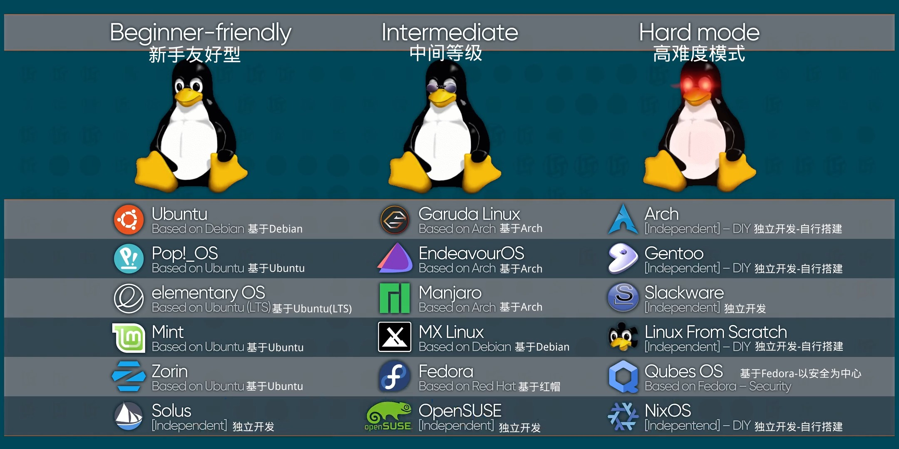
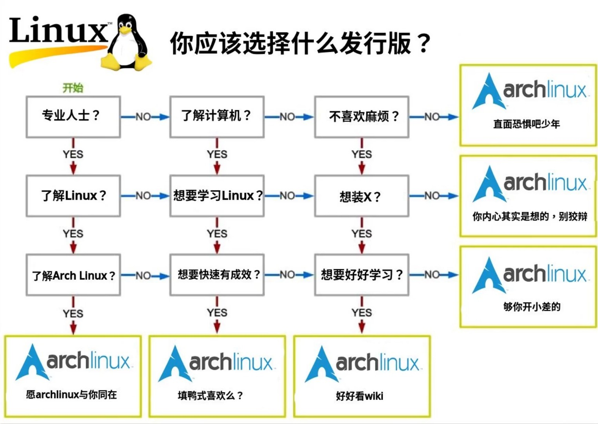

# <span style="text-transform: none;">Linux Install Party</span>

by [SHUOSC](https://shuosc.org)

<!--s-->
## 声明

事实上，Linux 指的是一个操作系统的内核，而Linux 一般和 GNU 操作系统一起使用：整个系统基本上就是 GNU 加上 Linux，或叫 GNU/Linux。

所有被叫做“Linux”的发行版实际上是 GNU/Linux 发行版。
<!--s-->
## <span style="text-transform: none;">为什么选择 Linux</span>
<!--v-->
### 开源自由

Linux 是开源的，你可以自由地使用、复制、分发、学习、修改 Linux
<!--v-->
### 安全稳定

由于 Linux 的开源性质，任何人都可以查看源代码，发现并修复漏洞，这使得 Linux 的安全性远高于 Windows
<!--v-->
### 轻量高效

- 遵循 [UNIX 哲学](https://zh.wikipedia.org/wiki/Unix%E5%93%B2%E5%AD%A6)“小即是美”
- 系统占用资源少，这使得 Linux 硬件下限极低
- 让你的老电脑焕发第二春
Note: 用过的 ThinkPad X1 Carbon 不要扔，来装 Linux
<!--v-->
### 适合程序员

- 强大的命令行
- 方便的包管理器（apt, pacman...）
- 详细的报错提示和日志信息
- 接近实际服务器环境

Note: Windows 的环境变量就是依托答辩
<!--v-->

### 自定义程度高

- 自定义内核(zen, lts, xanmod...)
- 自定义桌面环境(GNOME, KDE, XFCE, i3wm...)
- 自定义一切，理论上你可以自由修改 Linux 的任何开源代码并编译安装，~~让她彻底变成你的形状~~
<!--v-->
### <span style="text-transform: none;">Linux 应用实例</span>

- 服务器、超算
- 路由器
- Android
- ...
<!--v-->
### 日常使用

- 办公学习
- 娱乐
- 开发
- ...

Note: 事实上，Linux 对游戏的兼容性已经相当不错了，这主要得益于 Steam 的努力，Proton 项目极大地推进了 Linux 游戏的发展；此外，所有的开源游戏模拟器比如 citra、dolphin、yuzu 等的开发都是 Linux 优先的，Windows 版本只是附带的，所以如果你是个游戏爱好者，Linux 也是个不错的选择；甚至，你也能玩原神，只是需要一些额外的配置
<!--s-->
## <span style="text-transform: none;">Linux 常见发行版介绍</span>
适合自己的才是最好的
Note: 避免偏见，不讨论哪个发行版好，哪个发行版不好。
<!--v-->

<!--v-->
### 

- 简单易上手，适合新手
- 基于 Debian，有着丰富软件源
- 社区活跃，有大量的教程和问答
<!--v-->
### 

- 固若金汤，稳定性极强
- 坚守 UNIX 和自由软件的精神
- 有着丰富的软件源
- 支持众多计算机架构，
  
  同时也是众多发行版的直接上游或源头

Note: Debian 的自由精神已经上升到了一种哲学的地步，甚至影响到了人的意识形态
<!--v-->
### 

- 遵循 [KISS 原则](https://zh.wikipedia.org/wiki/KISS%E5%8E%9F%E5%88%99)，简单而高效，
- 滚动更新，永不过时
- 极其丰富的软件源和积极的社区支持
- Arch Wiki 是 Linux 社区最好的 Wiki
- 适合有 DIY 需求的用户，~~除了难装，其他都很简单~~
<!--v-->

<!--v-->
### 

- 基于 Arch Linux，但是更简单易用，适合新手
- 能使用大部分 Arch Linux 的软件源
- 界面美观，自带驱动，可更换内核
<!--v-->
### 

- 由 Red Hat 公司赞助，社区活跃
- 有着丰富的软件源
- Linus Torvalds 使用的发行版
- 适合有一定 Linux 基础的用户
<!--v-->
### 

- 新手友好，易于上手，有着优秀的桌面环境体验
- 特性丰富，YaST 以简便直接的形式控制系统的一切
- 坚如磐石，比较稳定，有社区和商业支持
<!--v-->
### 

- 国产 Linux 发行版，以美观易用著称
- 对国产应用以及中文支持友好
<!--v-->
### 

- 专注于渗透测试，内置大量渗透工具
- ~~KALI 学得好，牢饭吃到饱~~
<!--v-->
### 

- 勤快一时，懒惰一世
- 适合对性能有极高要求的用户
Note: Gentoo 每一部分都可以在最终用户的系统上重新编译建造，甚至包括最基本的系统库和编译器自身
<!--v-->
### 

- 声明式配置，纯函数式包管理
- 原子化升级和回滚
- 易于复现系统环境，安全稳定
- 适合进阶用户
<!--s-->
## <span style="text-transform: none;">Linux 安装的 N 种方式</span>
<!--v-->
### 实体机安装

- 无需虚拟化，性能最好
- 原汁原味
<!--v-->
### 虚拟机安装

- 无需重启
- 管理方便
- 隔离性好，安全稳定
<!--v-->
### WSL 安装

- 性能损耗低
- 无需重启
- 无缝切换
<!--v-->
### 容器安装

借助 [Termux](https://f-droid.org/zh_Hans/packages/com.termux/) 和 proot/chroot 容器可以实现在 Android 等设备上运行 Linux 系统

```shell
. <(curl -L gitee.com/mo2/linux/raw/2/2)
```
<!--s-->
## <span style="text-transform: none;">Talk is cheap, Let's install Linux</span>